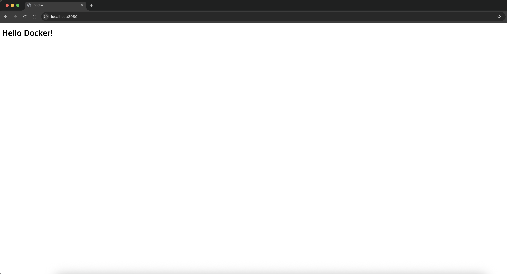

## 개발 환경
- Ubuntu 22.04
- ZSH Shell
- Docker version 28.2.2, build 28.2.2-0ubuntu1
- git version 2.51.0


## Command Line Interface

### 파일 / 디렉토리 관리
```zsh
pwd        # 현재 위치
ls         # 목록 보기
ls -al     # 숨김파일 포함 상세 보기
cd ~       # 홈으로 이동
cd ..      # 상위 폴더
```

### 파일 내용 확인
```zsh
mkdir test        # 폴더 생성
touch a.txt       # 파일 생성
rm a.txt          # 파일 삭제
rm -r test        # 폴더 삭제
```

### 복사 / 이동
```zsh
cp a.txt b.txt    # 복사
mv a.txt folder/  # 이동
mv a.txt b.txt    # 이름 변경
```

### 파일 내용 확인
```zsh
cat file.txt      # 전체 출력
less file.txt     # 페이지 단위 보기
head file.txt     # 앞부분
tail file.txt     # 뒷부분
tail -f log.txt   # 실시간 로그
```

### 검색 / 필터 (개발자 필수)
```zsh
grep "error" log.txt         # 문자열 검색
ps aux | grep python         # 프로세스 검색
history | grep docker        # 히스토리 검색
```

### 프로세스 관리
```zsh
ps aux               # 실행중 프로세스
top                  # 실시간 모니터링
kill -9 PID          # 프로세스 종료
```

### 네트워크 / 포트
```zsh
lsof -i :8000        # 포트 사용 확인
netstat -tuln        # 포트 상태
curl google.com      # 요청 테스트
```

### 시스템 정보
```zsh
uname -a     # 시스템 정보
df -h        # 디스크 사용량
free -h      # 메모리
```

### 절대 경로 (Absolute Path)
- 루트(최상위)부터 시작하는 전체 경로

/Users/7eerup/OrbStack/ubuntu/home/claude/aisw/ubuntu/script.sh
- 서버 배포 설정 외부 URL(절대 경로 필요)
- 

### 상대 경로 (Relative Path)
- 현재 위치 기준으로 표현
ubuntu/script.sh
- 이식성	폴더를 옮겨도 경로가 유지됨
- 간결성	경로가 짧고 읽기 쉬움
- 협업	팀원들과 공유해도 작동함
- 유연성	폴더 구조 변경에 강함

### ## Docker 컨테이너 실습 명령어 가이드
- Docker version 28.5.2, build ecc6942

### 이미지 실행
```bash
$ docker run hello-world
```

### 이미지 확인
```bash
$ docker images
```

### 컨테이너 실행 목록 확인
```bash
$ docker ps
```

### 특정 이미지 정보 확인
```bash
$ docker inspect hello-world
```

### 이미지 상세 정보 확인
```bash
$ docker image inspect hello-world
```

### 컨테이너 삭제
```bash
$ docker rm <CONTAINER ID>
```

### 이미지 삭제
```bash
$ docker rmi <IMAGE ID>
```

## Docker Ubuntu 컨테이너

### Ubuntu 이미지 컨테이너 생성 및 실행
```zsh
$ docker run -it --name my-ubuntu ubuntu:latest /bin/bash
```

### 현재 디렉토리의 파일/폴더 목록 표시 (숨김파일 제외)
```zsh
$ ls
```

### 현재 디렉토리의 모든 파일/폴더 상세 정보 표시 (숨김파일 포함)
```zsh
$ ls -la
```

### 텍스트 출력
```zsh
$ echo "Hello Docker!"
```

### 현재 작업 디렉토리의 절대 경로 출력
```zsh
$ pwd
```

### OS 정보 확인
```zsh
$ cat /etc/os-release
```

### 컨테이너 내 bash 셸 종료 (컨테이너도 중지됨)
```zsh
$ exit
```

### 중지된 'my-ubuntu' 컨테이너 재시작
```zsh
$ docker start my-ubuntu
```

### 실행 중인 컨테이너에 표준입력/출력 연결 (기존 프로세스에 접속)
```zsh
$ docker attach my-ubuntu
```

### 컨테이너 내 bash 셸 종료
```zsh
$ exit
```

### 중지된 컨테이너 재시작
```zsh
$ docker start my-ubuntu
```

```
attach: 메인 프로세스 제어 → exit하면 컨테이너 중지
exec: 새 프로세스 추가 → exit해도 컨테이너 유지
```

### 실행 중인 컨테이너에서 새로운 bash 프로세스 실행 (권장 방식)
```zsh
$ docker exec -it my-ubuntu /bin/bash
```

### 실행 중인 컨테이너 중지 (graceful shutdown)
```zsh
$ docker stop
```

### 컨테이너 삭제
```zsh
$ docker rm <CONTAINER ID>
```

### 컨테이너 이름으로 로그 확인
```zsh
$ docker logs my-ubuntu
```

### 컨테이너 ID로 로그 확인
```zsh
$ docker logs a1b2c3d4e5f6
```

### 실시간 로그 보기 (follow)
```zsh
$ docker logs -f my-ubuntu
```

### 마지막 10줄만 보기
```zsh
$ docker logs --tail 10 my-ubuntu
```

### 타임스탬프와 함께 보기
```zsh
$ docker logs -t my-ubuntu
```

### 마지막 10줄을 실시간으로 보기
```zsh
$ docker logs -f --tail 10 my-ubuntu
```

### 컨테이너 리소스 사용량 실시간 모니터링
```zsh
$ docker stats
```

### 특정 컨테이너 'my-ubuntu'의 리소스 사용량만 실시간 표시
```zsh
$ docker stats my-ubuntu
```

### 여러 컨테이너의 리소스 사용량을 동시에 실시간 표시
```zsh
$ docker stats my-ubuntu another-container
```


### ## Dockerfile NGINX 이미지 빌드

### 빌드
```zsh
$ docker build -t my-nginx-app:1.0 .
```

### 컨테이너 실행
```zsh
$ docker run -d -p 8080:80 --name my-nginx-server my-nginx-app:1.0
```

### 포트 매핑 접속 확인
```zsh
$ docker ps
```

### 웹 브라우저 접속
```zsh
$ curl http://localhost:8080
```

### 결과
>


### Nginx 로그 확인
```zsh
$ docker logs my-nginx-server
```

### 컨테이너 중지
```zsh
$ docker stop my-nginx-server
```

### 컨테이너 재시작
```zsh
$ docker restart my-nginx-server
```

### 컨테이너 삭제
```zsh
$ docker rm my-nginx-server
```

### 이미지 삭제
```zsh
$ docker rmi my-nginx-app:1.0
```

### 실시간 로그 확인
```zsh
$ docker logs -f my-nginx-server
```

### 포트 매핑 필요한 이유
포트 매핑 = 컨테이너 서비스를 호스트를 통해 외부에서 접속 가능
포트 매핑 없으면 컨테이너 내부에서만 서비스 가능 → 외부 접근 불가능


## Docker Volume 영속성 검증
- Docker 볼륨 컨테이너 외부에 데이터를 저장하는 메커니즘
- 영속성 컨테이너가 삭제되어도 데이터가 유지됨
- Mountpoint 호스트 시스템에서 실제 데이터가 저장되는 경로
- -v 옵션 볼륨을 컨테이너에 연결하는 명령어
- Mountpoint 경로가 실제 데이터가 저장되는 위치

### 생성
```zsh
$ docker volume create my-data
```

### 볼륨 목록 확인
```zsh
$ docker volume inspect my-data
```

### 컨테이너 생성 및 볼륨 연결
```zsh
$ docker run -d --name test-container \
  -v my-data:/app/data \
  ubuntu:22.04 \
  sleep 3600
```

### 컨테이너 내부에서 데이터 생성
```zsh
$ docker exec test-container bash -c \
  'echo "Hello Docker!" > /app/data/test.txt'
```

### 컨테이너 내부 추가 데이터 생성
```zsh
$ docker exec test-container bash -c \
  'echo "파일 1" > /app/data/file1.txt && \
   echo "파일 2" > /app/data/file2.txt && \
   echo "파일 3" > /app/data/file3.txt'
```

### 컨테이너 내부 추가 데이터 생성
```zsh
$ docker exec test-container ls -la /app/data/
```

### 컨테이너 삭제
```zsh
$ docker stop test-container
$ docker rm test-container
```

### 볼륨 데이터 확인
```zsh
$ docker volume inspect my-data
```

### 새로운 컨테이너로 기존 데이터 확인
```zsh
$ docker run -it --name verify-container \
  -v my-data:/app/data \
  ubuntu:22.04 \
  bash
  ```

### 컨테이너 삭제
```zsh
$ docker stop verify-container
$ docker rm verify-container
```

### 목록 확인
```zsh
$ docker volume ls
```


### 파일 권한
```zsh
-rwxrwxrwx
 │││││││││
 ││││││└└└── Others (다른 사용자)
 │││└└└───── Group (그룹)
 └└└──────── Owner (소유자)

r (read)    = 읽기 권한 = 4
w (write)   = 쓰기 권한 = 2
x (execute) = 실행 권한 = 1

r: 파일 내용을 읽을 수 있음
w: 파일을 수정/삭제할 수 있음
x: 파일을 실행할 수 있음 (프로그램, 스크립트)

rwx = 4+2+1 = 7 ✅ (모두 있음)
rw- = 4+2+0 = 6 ✅ (x 없음)
r-x = 4+0+1 = 5 ✅ (w 없음)
r-- = 4+0+0 = 4 ✅ (w, x 없음)
-wx = 0+2+1 = 3 ✅ (r 없음)
--x = 0+0+1 = 1 ✅ (r, w 없음)
--- = 0+0+0 = 0 ✅ (모두 없음)

755 해석
7 = 4+2+1 = rwx (소유자: 모든 권한)
5 = 4+0+1 = r-x (그룹: 읽기, 실행만)
5 = 4+0+1 = r-x (기타: 읽기, 실행만)

결과: 소유자는 모든 권한, 나머지는 읽기/실행만 가능

644 해석
6 = 4+2+0 = rw- (소유자: 읽기, 쓰기)
4 = 4+0+0 = r-- (그룹: 읽기만)
4 = 4+0+0 = r-- (기타: 읽기만)

결과: 소유자만 수정 가능, 나머지는 읽기만 가능
```

### 실행 권한 추가/제거
```zsh
$ chmod +x script.sh
$ chmod 755 script.sh
$ chmod 644 script.sh
```

### 권한 확인
```zsh
$ ls -l script.sh
```

### 컴퓨터 기본 단위
```zsh
단위	크기	설명
Bit	0 또는 1	컴퓨터 최소 단위
Byte	8 Bit	문자 1개 표현
KB (킬로바이트)	1,024 Byte	짧은 문서
MB (메가바이트)	1,024 KB	사진 1장
GB (기가바이트)	1,024 MB	영화 1편
TB (테라바이트)	1,024 GB	대용량 저장장치
PB (페타바이트)	1,024 TB	데이터센터
EB (엑사바이트)	1,024 PB	인터넷 전체 트래픽
```


## Git GitHub
| Image 1 | Image 2 |
|---------|---------|
|  |  |