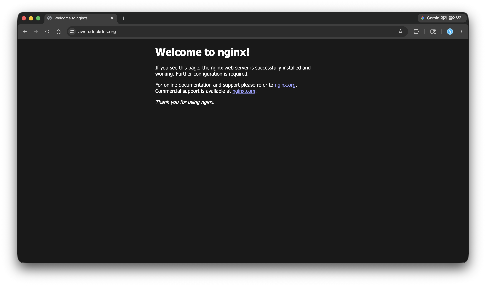

# Amazon Web Service

For Amazon Web Service [amazon.com](https://aws.amazon.com).

### System Architecture


### 네트워크 구성 요소 핵심 요약

| 구성 요소 | 역할 | 핵심 설정 |
| --- | --- | --- |
| `VPC` | AWS 안에서 사용하는 독립적인 가상 네트워크 | `10.0.0.0/16` |
| `Subnet` | VPC를 AZ 단위로 나눈 네트워크 영역 | Public Subnet `10.0.1.0/24` |
| `Route Table` | Subnet의 트래픽이 어디로 갈지 결정 | `0.0.0.0/0 → IGW` |
| `Internet Gateway` | VPC와 인터넷을 연결하는 출입구 | VPC Attach 필요 |


```bash
External User / External Service
        │
        │ HTTP(80), HTTPS(443), SSH(22)
        ▼
Internet
        │
        ▼
Internet Gateway (IGW)
        │
        │ VPC Attachment
        ▼
VPC (10.0.0.0/16)
        │
        ├── Route Table
        │      └── 0.0.0.0/0 → IGW
        │
        └── Public Subnet (10.0.1.0/24, ap-northeast-2a)
               │
               └── EC2 Instance (Public IP)
                      │
                      ├── Security Group
                      │      ├── Inbound SSH(22)  ← My IP
                      │      ├── Inbound HTTP(80) ← 0.0.0.0/0
                      │      └── Inbound HTTPS(443) ← 0.0.0.0/0
                      │
                      └── Web Service
                             ├── Nginx
                             └── Docker Container
```


### 트래픽 흐름 요약

1. `외부 사용자 → EC2 웹 서비스`
    * `HTTP(80)`, `HTTPS(443)` 요청이 Internet → Internet Gateway → Public Subnet → EC2로 전달
    * Security Group에서 80/443 인바운드를 허용해야 Nginx 또는 Docker Web Service 접근 가능

2. `관리자 → EC2 SSH`
    * SSH(22)는 관리자 IP만 접근하도록 `MyIP/32`로 제한

3. `EC2 → 외부 인터넷`
    * EC2 `curl` 요청은 Route Table의 `0.0.0.0/0 → IGW` 경로로 인터넷에 나감


### 핵심 조건

* Public Subnet은 Internet Gateway로 향하는 기본 라우트가 필요
* EC2는 Public IP 있어야 외부에서 직접 접근 가능
* Security Group은 필요한 포트만 최소 범위로 허용


### Security Group과 IAM 역할 차이
* Root 계정 = AWS 계정의 최고 소유자
* IAM = Root 대신 사용할 사용자/역할의 권한을 관리하는 시스템
* Security Group = EC2 네트워크 접근을 제어하는 방화벽


* 대상: EC2, RDS, Load Balancer 등 네트워크 인터페이스가 있는 리소스
* 제어 기준: IP, Port, Protocol
* 예시: 내 IP에서만 SSH(22) 허용, 외부에서 HTTP(80)/HTTPS(443) 허용
* 목적: 서버에 누가 어떤 네트워크 경로로 접근할 수 있는지 제한

`IAM`은 AWS 리소스를 생성, 수정, 삭제, 조회할 수 있는 권한을 제어

* 대상: 사용자, 그룹, 역할, 서비스 계정
* 제어 기준: AWS API Action, Resource, Condition
* 예시: EC2 조회만 허용, S3 특정 버킷만 접근 허용, 관리자 권한 제한
* 목적: 누가 어떤 AWS 작업을 수행할 수 있는지 제한

`Security Group`은 서버로 들어오는 길을 막거나 열고, `IAM`은 AWS에서 할 수 있는 작업 권한을 제한한다.


### 최소 권한 원칙

* 최소 권한 원칙은 필요한 권한만 허용하고, 필요하지 않은 권한은 주지 않는 보안 원칙

왜 적용하는가:

* 계정 또는 키가 노출되어도 피해 범위를 줄일 수 있음
* 실수로 리소스를 삭제하거나 변경하는 위험을 줄일 수 있음
* 운영자, 애플리케이션, 서비스별 책임 범위를 명확히 나눌 수 있음

어떻게 적용하는가:

* SSH(22)는 `0.0.0.0/0` 대신 `MyIP/32`로 제한
* HTTP(80), HTTPS(443)처럼 외부 공개가 필요한 포트만 허용
* IAM에는 `AmazonEC2FullAccess` `AmazonVPCFullAccess` 필요한 서비스와 작업만 허용
* 권한 변경 전에는 필요한 작업 범위를 먼저 확인하고, 변경 후에는 실제 동작을 검증


### 외부 요청이 EC2 웹 서버까지 도달하는 조건

외부 사용자가 브라우저에서 `http://PUBLIC_IP` 또는 `https://DOMAIN`으로 접속하려면 세 가지 조건이 맞아야 한다.

1. `퍼블릭 IP`
    * 외부 사용자가 EC2를 찾아갈 수 있는 인터넷 주소
    * EC2에 Public IP 또는 Elastic IP가 없으면 인터넷에서 직접 접근할 수 없음

2. `라우팅`
    * Public Subnet의 Route Table에 인터넷으로 나가는 경로가 필요
    * 기본 라우트는 `0.0.0.0/0 → Internet Gateway`
    * Internet Gateway는 VPC에 연결되어 있어야 함

3. `Security Group`
    * EC2 앞에서 요청을 허용하거나 차단하는 방화벽 역할
    * 웹 접속은 HTTP(80), HTTPS(443) 인바운드 규칙이 필요
    * SSH(22)는 전체 공개가 아니라 `MyIP/32`처럼 관리자 IP로 제한

흐름을 한 줄로 보면 다음과 같다.

```text
외부 사용자
→ EC2 Public IP
→ Internet Gateway
→ Public Subnet Route Table
→ Security Group 허용 확인
→ EC2 Web Server
```

즉, `Public IP`는 목적지 주소이고, `Route Table + Internet Gateway`는 이동 경로이며, `Security Group`은 마지막 접근 허용 조건이다.


### SSH 트러블슈팅


#### 1. 증상 확인

```bash
ssh -i key.pem ubuntu@PUBLIC_IP
```

로그에서 중요한 부분은 다음과 같다.

```text
WARNING: UNPROTECTED PRIVATE KEY FILE!
Permissions 0644 for 'awsu.pem' are too open.
This private key will be ignored.
Load key "key.pem": bad permissions
Permission denied (publickey).
```

`The authenticity of host ... can't be established` 메시지는 처음 접속하는 서버를 known hosts에 등록할지 묻는 정상 확인 절차다. 실제 오류는 개인 키 파일 권한이 너무 열려 있어서 SSH 클라이언트가 키를 사용하지 않는 것이다.

#### 2. 원인 가설

가설:`key.pem` 파일 권한이 `0644`라서 다른 사용자도 읽을 수 있는 상태다.

SSH 개인 키는 민감한 인증 정보이므로 소유자만 읽을 수 있어야 한다. 권한이 너무 넓으면 SSH가 보안상 위험하다고 판단하고 키를 무시한다.

#### 3. 검증

```bash
ls -l key.pem
```

예상 문제 상태:

```text
-rw-r--r--  key.pem
```

`rw-r--r--`는 소유자뿐 아니라 그룹/다른 사용자도 읽을 수 있다는 의미

#### 4. 조치

```bash
chmod 400 key.pem
ssh -i key.pem ubuntu@PUBLIC_IP
```

권한 변경 후 기대 상태:

```text
-r--------  key.pem
```

`chmod 400`은 키 소유자만 읽을 수 있게 제한


### HTTPS




### Docker Container Mapping Service Deployment


