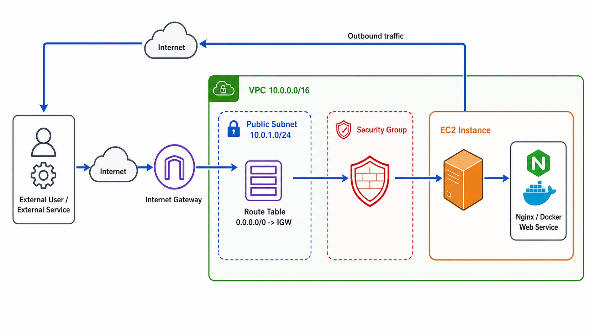
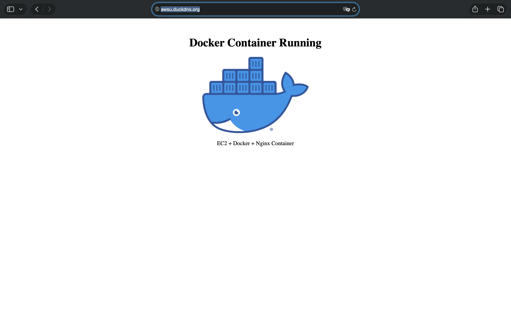

# Amazon Web Service

For Amazon Web Service [amazon.com](https://aws.amazon.com).

### System Architecture



### 네트워크 구성 요소 핵심 요약

| 구성 요소 | 역할 | 핵심 설정 |
| --- | --- | --- |
| `VPC` | AWS 안에서 사용하는 독립적인 가상 네트워크 | `10.0.0.0/16` |
| `Subnet` | VPC를 AZ 단위로 나눈 네트워크 영역 | Public Subnet `10.0.1.0/24` |
| `Route Table` | Subnet의 트래픽이 어디로 갈지 결정 | `0.0.0.0/0 → IGW` |
| `Internet Gateway` | VPC와 인터넷을 연결하는 출입구 | VPC Attach 필요 |


```bash
External User / External Service
        │
        │ HTTP(80), HTTPS(443), SSH(22)
        ▼
Internet
        │
        ▼
Internet Gateway (IGW)
        │
        │ VPC Attachment
        ▼
VPC (10.0.0.0/16)
        │
        ├── Route Table
        │      └── 0.0.0.0/0 → IGW
        │
        └── Public Subnet (10.0.1.0/24, ap-northeast-2a)
               │
               └── EC2 Instance (Public IP)
                      │
                      ├── Security Group
                      │      ├── Inbound SSH(22)  ← My IP
                      │      ├── Inbound HTTP(80) ← 0.0.0.0/0
                      │      └── Inbound HTTPS(443) ← 0.0.0.0/0
                      │
                      └── Web Service
                             ├── Nginx
                             └── Docker Container
```


### 트래픽 흐름 요약

1. `외부 사용자 → EC2 웹 서비스`
    * `HTTP(80)`, `HTTPS(443)` 요청이 Internet → Internet Gateway → Public Subnet → EC2로 전달
    * Security Group에서 80/443 인바운드를 허용해야 Nginx 또는 Docker Web Service 접근 가능

2. `관리자 → EC2 SSH`
    * SSH(22)는 관리자 IP만 허용

3. `EC2 → 외부 인터넷`
    * EC2 `curl` 요청은 Route Table의 `0.0.0.0/0 → IGW` 경로로 인터넷에 나감


| 리소스                   | 확인 위치                   | 확인 사항                    | 정리 여부 |
| --------------------- | ----------------------- | ------------------------ | ----- |
| EC2 Instance          | EC2 → Instances         | 실행/중지 인스턴스 삭제            |      |
| EBS Volume            | EC2 → Volumes           | 남아 있는 볼륨 삭제              |      |
| Elastic IP(EIP)       | EC2 → Elastic IPs       | 미사용 EIP 해제               |      |
| Internet Gateway(IGW) | VPC → Internet Gateways | VPC 연결 해제 후 삭제           |      |
| VPC                   | VPC → Your VPCs         | 실습용 VPC 삭제               |      |
| Subnet                | VPC → Subnets           | Public/Private Subnet 삭제 |      |
| Route Table           | VPC → Route Tables      | 실습용 RT 삭제                |      |
| Security Group        | EC2 → Security Groups   | 미사용 SG 삭제                |      |
| Load Balancer(ALB)    | EC2 → Load Balancers    | ALB 삭제                   |      |
| Target Group          | EC2 → Target Groups     | 연결 해제 후 삭제               |      |


### 보안 그룹 최소 권한 규칙

* Public Subnet은 Internet Gateway로 향하는 기본 라우트가 필요
* EC2는 Public IP 있어야 외부에서 직접 접근 가능
* Security Group 필요한 포트만 최소 범위로 허용
* `SSH` - 원격 접속
* `HTTP` - 일반 웹 브라우저 접속 필요
* `HTTPS` - 암호화 웹 서비스 제공(SSL 적용)
* `불필요한 DB/내부 포트` - Not Allowed
* `전체 포트 공개` - 0-65535


### 외부 접속 검증
* `인스턴스 생성`
* `SG 연동`
* `curl http://PUBLIC_IP`


### 태그 이름 규칙 활용
* `alias_ooo 접두어 규칙 사용`
* `리소스 식별`
* `비용 추적`
* `삭제 누락 방지`
* `운영 혼동 감소`


### Public Subnet Route Table의 기본 경로(0.0.0.0/0 → IGW) 필요한 이유

* `0.0.0.0/0` → “모든 외부 네트워크 목적지”를 의미하는 기본 경로(Default Route)
* `IGW (Internet Gateway)` → VPC와 인터넷을 연결하는 인터넷 연결 게이트웨이(출입구 역할)
* Public Subnet 내부 EC2가 인터넷과 통신하기 위해 모든 외부 트래픽을 IGW로 보내야 하기 때문

* 기본 경로가 필요한 대표 사례
    * 사용자가 웹 브라우저로 EC2 웹 서버 접속
    * EC2가 Ubuntu 패키지 다운로드 (apt update)
    * 외부 사용자 HTTP/HTTPS 접속

* 기본 경로가 없을 경우 - 0.0.0.0/0 → IGW 경로가 없으면 인터넷 연결은 동작(X)
    * 인터넷 통신 불가
    * 웹 서버 외부 접속 실패
    * 패키지 다운로드 실패


### Security Group과 IAM 역할 차이
* `Root 계정 = AWS 계정의 최고 소유자`
* `IAM = Root 대신 사용할 사용자/역할의 권한을 관리하는 시스템`
* `Security Group = 서버 네트워크(IP/Port) 접근을 제어`


### IAM AWS 권한 관리자
* `AWS 리소스를 누가 생성·수정·삭제 가능한지 제어`


### 최소 권한 원칙
* `최소 권한 원칙은 필요한 권한만 허용하고, 보안 위험 최소화 보안 원칙`
* `0.0.0.0/0 전체 포트 허용 금지`
* SSH(22) `MyIP`로 제한
* `HTTP(80), HTTPS(443)처럼 외부 공개가 필요한 포트만 허용`
* `IAM 필요한 서비스와 작업만 허용` - AmazonEC2FullAcess, AmazonVPCFullAccess


### SSH DB 포트 공개 안되는 이유
* 0.0.0.0/0 = 전 세계 모든 IP 접근 허용
* DB 정보 유출 위험
* 보안 탈취 위험
* DB-SG 생성 및 역할 분리 - 보안 강화 인터넷 직접 차단


### 외부 접속 안될 때 점검 방법
* `라우팅(Route Table) → Security Group(SG) Public IP/Public DNS → 서버 프로세스 / 로그`


### IAM 권한 부족 발생 시 대응 방법
* `서비스 오류 Action 정보 확인`
* `권한 부여`


### 트래픽 증가로 네트워크 병목 현상 해결 방법
* `EC2 1대에 모든 트래픽이 집중되는 것 문제` - CPU, 메모리, 네트워크 한계
* `ALB(Application Load Balancer)`
* `트래픽 분산`
* `HTTP/HTTPS 요청 처리`
* `하나의 접속 주소 제공`
* `ALB 추가 후 EC2 2대를 Target Group에 연결`
* `Health Check 확인`


### Billing에 예상치 못한 비용 발생 대처법
* `결제 및 비용 관리`
* `청구서`
* `Cost Explorer`

### 체크리스트

| 리소스           | 확인 위치                | 정리 방법                   |
| ------------- | -------------------- | ----------------------- |
| EC2           | EC2 → Instances      | Terminate               |
| Elastic IP    | EC2 → Elastic IPs    | Release                 |
| NAT Gateway   | VPC → NAT Gateways   | Delete                  |
| Load Balancer | EC2 → Load Balancers | Delete                  |
| RDS           | RDS → Databases      | Delete                  |
| EBS Volume    | EC2 → Volumes        | Delete available volume |
| Snapshot      | EC2 → Snapshots      | Delete                  |
| AMI           | EC2 → AMIs           | Deregister              |


### 외부 요청이 EC2 웹 서버까지 도달하는 조건

외부 사용자가 브라우저에서 `http://PUBLIC_IP` 또는 `https://DOMAIN`으로 접속하려면 세 가지 조건이 맞아야 한다.

1. `퍼블릭 IP`
    * 외부 사용자가 EC2를 찾아갈 수 있는 인터넷 주소
    * EC2에 Public IP 또는 Elastic IP가 없으면 인터넷에서 직접 접근할 수 없음

2. `라우팅`
    * Public Subnet의 Route Table에 인터넷으로 나가는 경로가 필요
    * 기본 라우트는 `0.0.0.0/0 → Internet Gateway`
    * Internet Gateway는 VPC에 연결되어 있어야 함

3. `Security Group`
    * EC2 앞에서 요청을 허용하거나 차단하는 방화벽 역할
    * 웹 접속은 HTTP(80), HTTPS(443) 인바운드 규칙이 필요
    * SSH(22)는 전체 공개가 아니라 `MyIP/32`처럼 관리자 IP로 제한


`Public IP`는 목적지 주소이고, `Route Table + Internet Gateway`는 이동 경로이며, `Security Group`은 마지막 접근 허용 조건이다.

```text
외부 사용자
→ EC2 Public IP
→ Internet Gateway
→ Public Subnet Route Table
→ Security Group 허용 확인
→ EC2 Web Server
```

### HTTPS
* `인터넷 통신 내용을 암호화하는 보안 기술`
* `DuckDNS 도메인 -> Certbot -> Let's Encrypt 인증서 발급 -> nginx HTTPS 적용`
* `데이터 암호화` - 중간 탈취 방지
* `서버 신뢰성 검증` - 가짜 사이트 방지
* `브라우저 보안 표시` - 🔒 자물쇠 표시


### Docker Container Mapping Service Deployment



