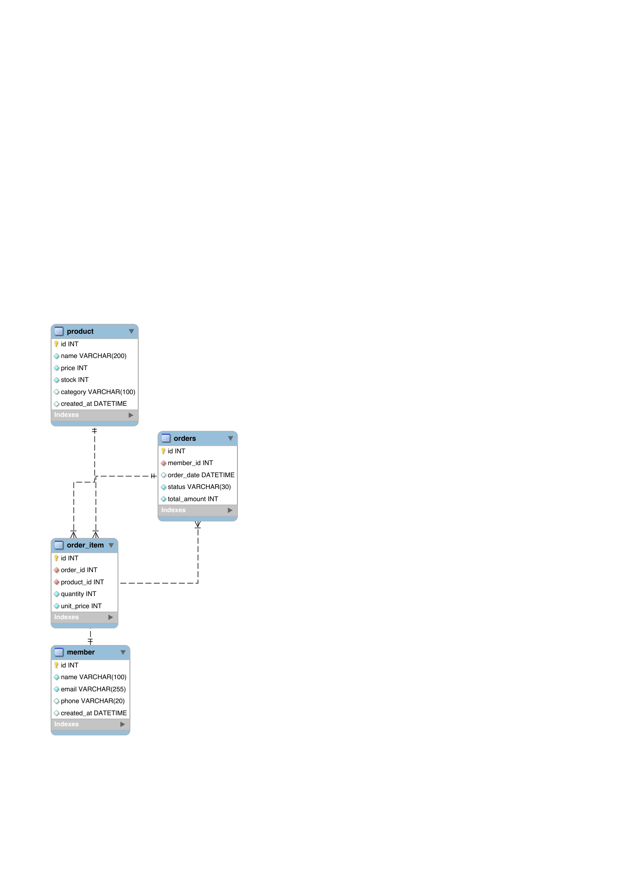

# SQL


### 온라인 쇼핑몰 데이터베이스 SQL 설계

* 회원, 상품, 주문, 주문상세를 각각 독립된 테이블로 분리하고 PK와 FK로 연결하여 데이터 정합성을 유지하도록 설계

* member 회원 정보 관리 - id(회원 고유 번호) name(회원 이름) email(이메일) phone 선택 입력 created_at(회원 생성 시간)

* product 상품 정보 관리 - id(상품 고유 번호) name(상품명) price(상품 가격) stock(재고 수량) 저장 기본 값 0 category(상품 분류) created_at(상품 등록 시간)

* orders 주문 정보 관리 - member_id(주문한 회원 번호) order_date(주문 날짜) status(주문 상태) total_amount(주문 금액)

* order_item 주문과 상품을 연결하고 주문 상세를 관리 - id(주문 상세 고유 번호) order_id(어떤 주문인지) product_id(어떤 상품인지) quantity(주문 수량) unit_price(주문 당시 상품 가격)
* member와 orders는 1:N 관계이며, 회원 한 명은 여러 주문을 생성할 수 있다.
* orders와 order_item은 1:N 관계이며, 하나의 주문에는 여러 상품이 포함될 수 있다.
* product와 order_item은 1:N 관계이며, 하나의 상품은 여러 주문 상세에서 참조될 수 있다.
* order_item 테이블을 통해 orders와 product 사이의 N:M 관계를 1:N 관계 두 개로 분리하여 데이터 정합성을 유지하였다.


### FK 관계도
* member (1) → orders (N) - 회원 1명은 여러 주문 가능
* orders (1) → order_item (N) - 주문 1건에는 여러 상품이 포함
* product (1) → order_item (N) - 하나의 상품은 여러 주문에서 판매 가능

| 부모 테이블  | 자식 테이블     | FK 컬럼                 |
| ------- | ---------- | --------------------- |
| member  | orders     | orders.member_id      |
| orders  | order_item | order_item.order_id   |
| product | order_item | order_item.product_id |

---

### ERD



---


### DATABASE EXCEL 다른점과 테이블 나누고 저장 이유

* `관계형 데이터베이스는 데이터를 역할별 테이블로 분리하고 PK와 FK를 이용해 관계를 연결하여, 데이터 무결성을 유지하면서 효율적으로 관리하는 데이터베이스`
* `Excel = 데이터를 표 형태로 저장하고 관리하는 도구`
* `데이터 중복 감소` - 같은 정보 반복 저장 방지
* `데이터 무결성` - 잘못된 데이터 입력 방지
* `관계 표현 가능` - PK/FK 사용
* `유지보수 용이` - 수정 시 한 곳만 변경
* `JOIN 가능` - 여러 테이블을 한 번에 조회


### Primary Key / Foreign Key 역할 1:N 관계 데이터 연결 방법
* `PK(Primary Key)` - 테이블의 각 데이터를 구별하는 고유 번호(인덱스 자동 생성, 중복 불가)
* `FK(Foreign Key)` - 다른 테이블의 PK를 참조하여 테이블 간 관계를 연결하는 역할
* `FK를 사용하면 주문이 어떤 회원의 주문인지 주문 상세가 어떤 주문과 상품에 속하는지 연결 가능`
* `1:N 관계` - 하나(1)의 데이터가 여러 개(N)의 데이터를 가질 수 있는 관계
* `member 1 : N orders` - 회원 1명 → 주문 여러 개 가능(주문 1개는 한 회원에만 속함)
* `SHOW CREATE TABLE orders;` - FK 연결 구조 확인
* `SHOW CREATE TABLE order_item;`


### SELECT / INSERT / UPDATE / DELETE 구분
* [CRUD](crud.sql)


### JOIN GROUP BY 연결된 데이터를 한 번에 뽑는 방법
* `JOIN 서로 연결된 여러 테이블 데이터를 하나로 합쳐 조회하는 기능`
* `GROUP BY 같은 값을 가진 데이터를 그룹화 후 개수(COUNT) 합계(SUM) 평균(AVG) 계산 기능`
* `JOIN + GROUP BY 연결된 데이터를 기준으로 통계 및 집계 결과를 조회`
* `여러 테이블에 나뉘어 저장된 데이터를 연결(JOIN)한 후, 원하는 기준으로 묶어(GROUP BY) 실무에서 필요한 통계와 집계 결과를 한 번에 조회`
* `FROM member m` - member 테이블 조회
* `JOIN orders o` - orders 테이블 연결
* `ON 조건 적용` - 회원 번호와 주문의 회원 번호가 같은 데이터 연결


### INNER JOIN과 LEFT JOIN의 차이
* [CRUD](crud.sql)
* INNER JOIN은 두 테이블에 모두 존재하는 데이터만 조회
* member.id와 orders.member_id가 일치하는 행만 결과에 포함된다.
* 따라서 주문 정보가 있는 회원만 조회된다.
* LEFT JOIN은 왼쪽 테이블(member)의 모든 데이터를 조회한다.
* 일치하는 주문이 있으면 주문 정보를 함께 출력하고 일치하는 주문이 없으면 주문 컬럼은 NULL로 출력한다.


### GROUP BY 집계 함수(COUNT, SUM, AVG)
* GROUP BY는 데이터를 묶고, COUNT, SUM, AVG는 묶인 데이터에 대한 통계를 계산
* LEFT JOIN - member 테이블을 기준으로 orders 테이블을 연결하는 역할
* m.id와 o.member_id가 같은 데이터를 연결
* LEFT JOIN을 사용하면 주문이 없는 회원도 결과에 포함된다.
* 회원 테이블을 기준으로 주문 테이블을 연결하며, 주문이 없는 회원도 결과에 포함하기 위해 사용한다.


### SQL 검색/정렬/집계/랭킹 활용
* `자주 사용하는 검색, 정렬, 집계, 그룹 통계, 랭킹 조회 예제를 정리한 SQL 파일`
* `원하는 데이터를 빠르게 검색하고, 정렬하고, 통계 내고, 순위를 계산하는 작업`


### 인덱스(Index) 필요성
* `데이터를 더 빠르게 찾기 위한 구조`
* `인덱스가 없으면 DB는 처음 행부터 끝까지 전부 검사`
* 최근 주문 조회 월별 주문 조회 특정 기간 주문 조회 주문 내역 정렬 기능 사용
* Table Scan(전체 테이블 스캔) - 인덱스가 테이블의 모든 행을 처음부터 끝까지 확인해야 한다.


### 인덱스(Index) 효과
* `WHERE 자주 검색되는 컬럼` - 검색 속도 향상
* `JOIN에 사용되는 FK 컬럼` - 테이블 연결 속도 향상
* `ORDER BY 컬럼` - 정렬 성능 향상
* `정렬 성능 향상` - 반복 검색 최적화

---

## Advanced SQL


### JOIN 방식 SQL vs 서브쿼리 방식 SQL 비교

* `orders.member_id와 member.id를 연결해서 주문 정보와 회원 이름을 함께 조회`
* JOIN 방식은 orders와 member 테이블을 한 번에 연결해서 조회한다.
* 서브쿼리 방식은 orders의 각 행마다 member 테이블에서 회원 이름을 다시 조회한다.
* 결과는 같지만, 일반적으로 여러 테이블의 데이터를 함께 조회할 때는 JOIN 방식이 더 직관적이고 성능상 유리하다. 서브쿼리 방식은 특정 값 하나를 계산하거나 조건으로 비교할 때 유용하지만, 여러 행을 반복 조회할 경우 비효율적일 수 있다.
* 현재 실습 데이터는 10건 수준이라 JOIN과 서브쿼리의 실행 속도 차이를 체감하기 어렵고 하지만 데이터가 수십만~수백만 건으로 증가하면 JOIN은 데이터베이스가 효율적으로 최적화할 수 있는 반면, 서브쿼리는 반복 조회가 발생할 수 있어 성능 차이가 나타날 수 있습니다.


### 데이터 정합성 FK 에러 발생 테스트

* `정합성(Integrity) 데이터 사이의 관계가 올바르게 유지되는 상태`
* `중요` - 에러가 발생한 이유는 현재 테이블 관계 때문인데 예를 들어 member 테이블에 id 10개 존재한다면 order.member_id = 999 존재하지 않기 때문이다.


### MySQL 오류 발생
```sql
ERROR 1452 (23000): Cannot add or update a child row: a foreign key constraint fails (`online_shop_db`.`orders`, CONSTRAINT `fk_orders_member` FOREIGN KEY (`member_id`) REFERENCES `member` (`id`))
```

### 원인
* orders.member_id는 member.id를 참조하는 FK이다.
* member 테이블에 id=999인 회원이 없기 때문에 데이터 정합성을 깨뜨리는 입력으로 판단되어 DB가 차단

```sql
member (부모)
   │
   └── orders.member_id (자식)
```

### 해결 방법
* 존재하는 회원 id 사용
* FK는 부모 테이블에 없는 데이터를 참조하지 못하게 하여 데이터 무결성 보장
* TRUNCATE TABLE orders;
* DELETE FROM orders WHERE id = 11;
* ALTER TABLE orders AUTO_INCREMENT = 1;

---

### 실행 결과

#### 전체 조회
```sql
mysql> SELECT * FROM member;
+----+-----------+--------------------------+---------------+---------------------+
| id | name      | email                    | phone         | created_at          |
+----+-----------+--------------------------+---------------+---------------------+
|  1 | 김민준    | minjun.kim@example.com   | 010-1111-1111 | 2026-05-23 19:46:06 |
|  2 | 이서연    | seoyeon.lee@example.com  | 010-2222-2222 | 2026-05-23 19:46:06 |
|  3 | 박지호    | jiho.park@example.com    | 010-3333-3333 | 2026-05-23 19:46:06 |
|  4 | 최하은    | haeun.choi@example.com   | 010-4444-4444 | 2026-05-23 19:46:06 |
|  5 | 정도윤    | doyoon.jung@example.com  | 010-5555-5555 | 2026-05-23 19:46:06 |
|  6 | 강서준    | seojun.kang@example.com  | 010-6666-6666 | 2026-05-23 19:46:06 |
|  7 | 조유나    | yuna.cho@example.com     | 010-7777-7777 | 2026-05-23 19:46:06 |
|  8 | 윤지민    | jimin.yoon@example.com   | 010-8888-8888 | 2026-05-23 19:46:06 |
|  9 | 장현우    | hyunwoo.jang@example.com | 010-9999-9999 | 2026-05-23 19:46:06 |
| 10 | 임수아    | sua.lim@example.com      | 010-0000-0000 | 2026-05-23 19:46:06 |
+----+-----------+--------------------------+---------------+---------------------+
10 rows in set (0.005 sec)
```

#### 상품 조회
```sql
mysql> SELECT * FROM product WHERE category = '전자기기';
+----+------------------------+-------+-------+--------------+---------------------+
| id | name                   | price | stock | category     | created_at          |
+----+------------------------+-------+-------+--------------+---------------------+
|  1 | 무선 마우스            | 25000 |    50 | 전자기기     | 2026-05-23 19:55:04 |
|  2 | 기계식 키보드          | 89000 |    30 | 전자기기     | 2026-05-23 19:55:04 |
|  3 | USB-C 충전기           | 19000 |    80 | 전자기기     | 2026-05-23 19:55:04 |
|  7 | 블루투스 이어폰        | 59000 |    25 | 전자기기     | 2026-05-23 19:55:04 |
+----+------------------------+-------+-------+--------------+---------------------+
4 rows in set (0.004 sec)
```

#### 가격이 높은 상품 순으로 조회
```sql
mysql> SELECT * FROM product
    -> ORDER BY price DESC;
+----+------------------------+-------+-------+--------------+---------------------+
| id | name                   | price | stock | category     | created_at          |
+----+------------------------+-------+-------+--------------+---------------------+
|  2 | 기계식 키보드          | 89000 |    30 | 전자기기     | 2026-05-23 19:55:04 |
|  7 | 블루투스 이어폰        | 59000 |    25 | 전자기기     | 2026-05-23 19:55:04 |
|  4 | 노트북 거치대          | 32000 |    40 | 사무용품     | 2026-05-23 19:55:04 |
|  9 | LED 스탠드             | 27000 |    35 | 생활용품     | 2026-05-23 19:55:04 |
|  1 | 무선 마우스            | 25000 |    50 | 전자기기     | 2026-05-23 19:55:04 |
| 10 | 휴대용 선풍기          | 22000 |    60 | 생활용품     | 2026-05-23 19:55:04 |
|  3 | USB-C 충전기           | 19000 |    80 | 전자기기     | 2026-05-23 19:55:04 |
|  5 | 텀블러                 | 15000 |   100 | 생활용품     | 2026-05-23 19:55:04 |
|  6 | 에코백                 | 12000 |    70 | 패션잡화     | 2026-05-23 19:55:04 |
|  8 | 마우스패드             |  8000 |   120 | 사무용품     | 2026-05-23 19:55:04 |
+----+------------------------+-------+-------+--------------+---------------------+
10 rows in set (0.002 sec)
```

#### 주문 금액이 높은 상위 5개 주문 조회
```sql
mysql> SELECT * FROM orders
    -> ORDER BY total_amount DESC
    -> LIMIT 5;
+----+-----------+---------------------+-----------+--------------+
| id | member_id | order_date          | status    | total_amount |
+----+-----------+---------------------+-----------+--------------+
|  2 |         2 | 2026-05-02 11:20:00 | PAID      |        89000 |
|  7 |         7 | 2026-05-07 18:20:00 | SHIPPED   |        59000 |
|  1 |         1 | 2026-05-01 10:15:00 | ORDERED   |        50000 |
|  3 |         3 | 2026-05-03 14:30:00 | SHIPPED   |        38000 |
|  4 |         4 | 2026-05-04 09:10:00 | DELIVERED |        32000 |
+----+-----------+---------------------+-----------+--------------+
5 rows in set (0.002 sec)
```

#### 회원 이름과 주문 정보 조회: INNER JOIN
```sql
mysql> SELECT m.name, o.id AS order_id, o.status, o.total_amount
    -> FROM member m
    -> INNER JOIN orders o ON m.id = o.member_id;
+-----------+----------+-----------+--------------+
| name      | order_id | status    | total_amount |
+-----------+----------+-----------+--------------+
| 김민준    |        1 | ORDERED   |        50000 |
| 이서연    |        2 | PAID      |        89000 |
| 박지호    |        3 | SHIPPED   |        38000 |
| 최하은    |        4 | DELIVERED |        32000 |
| 정도윤    |        5 | PAID      |        15000 |
| 강서준    |        6 | ORDERED   |        12000 |
| 조유나    |        7 | SHIPPED   |        59000 |
| 윤지민    |        8 | DELIVERED |        16000 |
| 장현우    |        9 | PAID      |        27000 |
| 임수아    |       10 | ORDERED   |        22000 |
+-----------+----------+-----------+--------------+
10 rows in set (0.001 sec)
```


#### 주문 상세와 상품명 조회: INNER JOIN
```sql
mysql> SELECT oi.id, p.name AS product_name, oi.quantity, oi.unit_price
    -> FROM order_item oi
    -> INNER JOIN product p ON oi.product_id = p.id;
+----+------------------------+----------+------------+
| id | product_name           | quantity | unit_price |
+----+------------------------+----------+------------+
|  1 | 무선 마우스            |        2 |      25000 |
|  2 | 기계식 키보드          |        1 |      89000 |
|  3 | USB-C 충전기           |        2 |      19000 |
|  4 | 노트북 거치대          |        1 |      32000 |
|  5 | 텀블러                 |        1 |      15000 |
|  6 | 에코백                 |        1 |      12000 |
|  7 | 블루투스 이어폰        |        1 |      59000 |
|  8 | 마우스패드             |        2 |       8000 |
|  9 | LED 스탠드             |        1 |      27000 |
| 10 | 휴대용 선풍기          |        1 |      22000 |
+----+------------------------+----------+------------+
10 rows in set (0.001 sec)
```

#### 주문, 회원, 상품 상세 조회
```sql
SELECT 
    ->     o.id AS order_id,
    ->     m.name AS member_name,
    ->     p.name AS product_name,
    ->     oi.quantity,
    ->     oi.unit_price,
    ->     oi.quantity * oi.unit_price AS item_total
    -> FROM orders o
    -> INNER JOIN member m ON o.member_id = m.id
    -> INNER JOIN order_item oi ON o.id = oi.order_id
    -> INNER JOIN product p ON oi.product_id = p.id;
+----------+-------------+------------------------+----------+------------+------------+
| order_id | member_name | product_name           | quantity | unit_price | item_total |
+----------+-------------+------------------------+----------+------------+------------+
|        1 | 김민준      | 무선 마우스            |        2 |      25000 |      50000 |
|        2 | 이서연      | 기계식 키보드          |        1 |      89000 |      89000 |
|        3 | 박지호      | USB-C 충전기           |        2 |      19000 |      38000 |
|        4 | 최하은      | 노트북 거치대          |        1 |      32000 |      32000 |
|        5 | 정도윤      | 텀블러                 |        1 |      15000 |      15000 |
|        6 | 강서준      | 에코백                 |        1 |      12000 |      12000 |
|        7 | 조유나      | 블루투스 이어폰        |        1 |      59000 |      59000 |
|        8 | 윤지민      | 마우스패드             |        2 |       8000 |      16000 |
|        9 | 장현우      | LED 스탠드             |        1 |      27000 |      27000 |
|       10 | 임수아      | 휴대용 선풍기          |        1 |      22000 |      22000 |
+----------+-------------+------------------------+----------+------------+------------+
10 rows in set (0.005 sec)
```

#### 주문이 없는 회원까지 포함해 조회: LEFT JOIN
```sql
mysql> SELECT m.id, m.name, o.id AS order_id, o.status
    -> FROM member m
    -> LEFT JOIN orders o ON m.id = o.member_id;
+----+-----------+----------+-----------+
| id | name      | order_id | status    |
+----+-----------+----------+-----------+
|  1 | 김민준    |        1 | ORDERED   |
|  2 | 이서연    |        2 | PAID      |
|  3 | 박지호    |        3 | SHIPPED   |
|  4 | 최하은    |        4 | DELIVERED |
|  5 | 정도윤    |        5 | PAID      |
|  6 | 강서준    |        6 | ORDERED   |
|  7 | 조유나    |        7 | SHIPPED   |
|  8 | 윤지민    |        8 | DELIVERED |
|  9 | 장현우    |        9 | PAID      |
| 10 | 임수아    |       10 | ORDERED   |
+----+-----------+----------+-----------+
10 rows in set (0.001 sec)
```

#### 회원별 주문 수 집계: COUNT + GROUP BY
```sql
mysql> SELECT m.name, COUNT(o.id) AS order_count
    -> FROM member m
    -> LEFT JOIN orders o ON m.id = o.member_id
    -> GROUP BY m.id, m.name;
+-----------+-------------+
| name      | order_count |
+-----------+-------------+
| 김민준    |           1 |
| 이서연    |           1 |
| 박지호    |           1 |
| 최하은    |           1 |
| 정도윤    |           1 |
| 강서준    |           1 |
| 조유나    |           1 |
| 윤지민    |           1 |
| 장현우    |           1 |
| 임수아    |           1 |
+-----------+-------------+
10 rows in set (0.006 sec)
```

#### 주문 상태별 총 주문 금액 집계: SUM + GROUP BY
```sql
mysql> SELECT status, SUM(total_amount) AS total_sales
    -> FROM orders
    -> GROUP BY status;
+-----------+-------------+
| status    | total_sales |
+-----------+-------------+
| DELIVERED |       98000 |
| PAID      |      131000 |
| SHIPPED   |       97000 |
| ORDERED   |       34000 |
+-----------+-------------+
4 rows in set (0.001 sec)
```

#### 카테고리별 평균 상품 가격: AVG + GROUP BY
```sql
mysql> SELECT *
    -> FROM orders
    -> WHERE total_amount > (
    ->     SELECT AVG(total_amount)
    ->     FROM orders
    -> );
+----+-----------+---------------------+---------+--------------+
| id | member_id | order_date          | status  | total_amount |
+----+-----------+---------------------+---------+--------------+
|  1 |         1 | 2026-05-01 10:15:00 | ORDERED |        50000 |
|  2 |         2 | 2026-05-02 11:20:00 | PAID    |        89000 |
|  3 |         3 | 2026-05-03 14:30:00 | SHIPPED |        38000 |
|  7 |         7 | 2026-05-07 18:20:00 | SHIPPED |        59000 |
+----+-----------+---------------------+---------+--------------+
4 rows in set (0.005 sec)
```

#### 카테고리별 평균 상품 가격: AVG + GROUP BY
```sql
mysql> SELECT category, AVG(price) AS avg_price
    -> FROM product
    -> GROUP BY category;
+--------------+------------+
| category     | avg_price  |
+--------------+------------+
| 전자기기     | 48000.0000 |
| 사무용품     | 20000.0000 |
| 생활용품     | 21333.3333 |
| 패션잡화     | 12000.0000 |
+--------------+------------+
4 rows in set (0.001 sec)
```

#### 평균 주문 금액보다 큰 주문 조회: 서브쿼리
```sql
mysql> SELECT *
    -> FROM orders
    -> WHERE total_amount > (
    ->     SELECT AVG(total_amount)
    ->     FROM orders
    -> );
+----+-----------+---------------------+---------+--------------+
| id | member_id | order_date          | status  | total_amount |
+----+-----------+---------------------+---------+--------------+
|  1 |         1 | 2026-05-01 10:15:00 | ORDERED |        50000 |
|  2 |         2 | 2026-05-02 11:20:00 | PAID    |        89000 |
|  3 |         3 | 2026-05-03 14:30:00 | SHIPPED |        38000 |
|  7 |         7 | 2026-05-07 18:20:00 | SHIPPED |        59000 |
+----+-----------+---------------------+---------+--------------+
4 rows in set (0.001 sec)
```

#### 주문 상태 수정: UPDATE
```sql
mysql> UPDATE orders
    -> SET status = 'DELIVERED'
    -> WHERE id = 1;
Query OK, 0 rows affected (0.001 sec)
Rows matched: 1  Changed: 0  Warnings: 0
```

#### 수정 결과 조회
```sql
mysql> SELECT * FROM orders WHERE id = 1;
+----+-----------+---------------------+-----------+--------------+
| id | member_id | order_date          | status    | total_amount |
+----+-----------+---------------------+-----------+--------------+
|  1 |         1 | 2026-05-01 10:15:00 | DELIVERED |        50000 |
+----+-----------+---------------------+-----------+--------------+
```

#### 상품 재고 수정
```sql
UPDATE product
SET stock = stock - 2
WHERE id = 1;
```

#### 수정 결과 확인
```sql
SELECT * FROM product WHERE id = 1;

+----+------------------+-------+-------+--------------+---------------------+
| id | name             | price | stock | category     | created_at          |
+----+------------------+-------+-------+--------------+---------------------+
|  1 | 무선 마우스      | 25000 |    20 | 전자기기     | 2026-05-23 19:55:04 |
+----+------------------+-------+-------+--------------+---------------------+
```

#### 삭제 예시: DELETE
```sql
mysql> DELETE FROM order_item
    -> WHERE id = 10;
Query OK, 1 row affected (0.003 sec)
```

#### 결과
```sql
mysql> SELECT * FROM order_item;
+----+----------+------------+----------+------------+
| id | order_id | product_id | quantity | unit_price |
+----+----------+------------+----------+------------+
|  1 |        1 |          1 |        2 |      25000 |
|  2 |        2 |          2 |        1 |      89000 |
|  3 |        3 |          3 |        2 |      19000 |
|  4 |        4 |          4 |        1 |      32000 |
|  5 |        5 |          5 |        1 |      15000 |
|  6 |        6 |          6 |        1 |      12000 |
|  7 |        7 |          7 |        1 |      59000 |
|  8 |        8 |          8 |        2 |       8000 |
|  9 |        9 |          9 |        1 |      27000 |
+----+----------+------------+----------+------------+
9 rows in set (0.001 sec)
```


#### 인덱스 생성: 주문 날짜 검색과 정렬을 빠르게 하기 위해 생성
* 목적: 주문 날짜 기준 검색, 범위 조회, 정렬 성능 향상
```sql
mysql> CREATE INDEX idx_orders_order_date
ON orders(order_date);

mysql> desc orders;
+--------------+-------------+------+-----+-------------------+-------------------+
| Field        | Type        | Null | Key | Default           | Extra             |
+--------------+-------------+------+-----+-------------------+-------------------+
| id           | int         | NO   | PRI | NULL              | auto_increment    |
| member_id    | int         | NO   | MUL | NULL              |                   |
| order_date   | datetime    | YES  | MUL | CURRENT_TIMESTAMP | DEFAULT_GENERATED |
| status       | varchar(30) | NO   |     | ORDERED           |                   |
| total_amount | int         | NO   |     | 0                 |                   |
+--------------+-------------+------+-----+-------------------+-------------------+
```


#### 주문일 기준 내림차순 정렬 조회
```sql
mysql> SELECT *
    -> FROM orders
    -> ORDER BY order_date DESC;
+----+-----------+---------------------+-----------+--------------+
| id | member_id | order_date          | status    | total_amount |
+----+-----------+---------------------+-----------+--------------+
| 10 |        10 | 2026-05-10 12:25:00 | ORDERED   |        22000 |
|  9 |         9 | 2026-05-09 08:50:00 | PAID      |        27000 |
|  8 |         8 | 2026-05-08 20:10:00 | DELIVERED |        16000 |
|  7 |         7 | 2026-05-07 18:20:00 | SHIPPED   |        59000 |
|  6 |         6 | 2026-05-06 13:00:00 | ORDERED   |        12000 |
|  5 |         5 | 2026-05-05 16:45:00 | PAID      |        15000 |
|  4 |         4 | 2026-05-04 09:10:00 | DELIVERED |        32000 |
|  3 |         3 | 2026-05-03 14:30:00 | SHIPPED   |        38000 |
|  2 |         2 | 2026-05-02 11:20:00 | PAID      |        89000 |
|  1 |         1 | 2026-05-01 10:15:00 | DELIVERED |        50000 |
+----+-----------+---------------------+-----------+--------------+
```


#### 특정 날짜 이후 주문 조회
```sql
SELECT *
FROM orders
WHERE order_date >= '2026-01-01';

+----+-----------+---------------------+-----------+--------------+
| id | member_id | order_date          | status    | total_amount |
+----+-----------+---------------------+-----------+--------------+
|  1 |         1 | 2026-05-01 10:15:00 | DELIVERED |        50000 |
|  2 |         2 | 2026-05-02 11:20:00 | PAID      |        89000 |
|  3 |         3 | 2026-05-03 14:30:00 | SHIPPED   |        38000 |
|  4 |         4 | 2026-05-04 09:10:00 | DELIVERED |        32000 |
|  5 |         5 | 2026-05-05 16:45:00 | PAID      |        15000 |
|  6 |         6 | 2026-05-06 13:00:00 | ORDERED   |        12000 |
|  7 |         7 | 2026-05-07 18:20:00 | SHIPPED   |        59000 |
|  8 |         8 | 2026-05-08 20:10:00 | DELIVERED |        16000 |
|  9 |         9 | 2026-05-09 08:50:00 | PAID      |        27000 |
| 10 |        10 | 2026-05-10 12:25:00 | ORDERED   |        22000 |
+----+-----------+---------------------+-----------+--------------+
```

#### 실행 계획 확인
* EXPLAIN : 실제 조회 전에 MySQL이 어떤 방식으로 데이터를 찾는지 확인
* Filter: order_date가 2026-01-01 이상인 데이터만 필터링
* Scan: orders 테이블의 모든 행을 처음부터 끝까지 읽음
* Cost: MySQL 옵티마이저가 계산한 예상 비용 -> 값이 작을수록 효율적
* rows=11: 약 11개의 행을 읽을 것으로 예상
```sql
EXPLAIN
SELECT *
FROM orders
WHERE order_date >= '2026-01-01';

+-----------------------------------------------------------------------------------------------------------------------------------------+
| EXPLAIN                                                                                                                                 |
+-----------------------------------------------------------------------------------------------------------------------------------------+
| -> Filter: (orders.order_date >= TIMESTAMP'2026-01-01 00:00:00')  (cost=1.35 rows=10)
    -> Table scan on orders  (cost=1.35 rows=11)
 |
+-----------------------------------------------------------------------------------------------------------------------------------------+
```